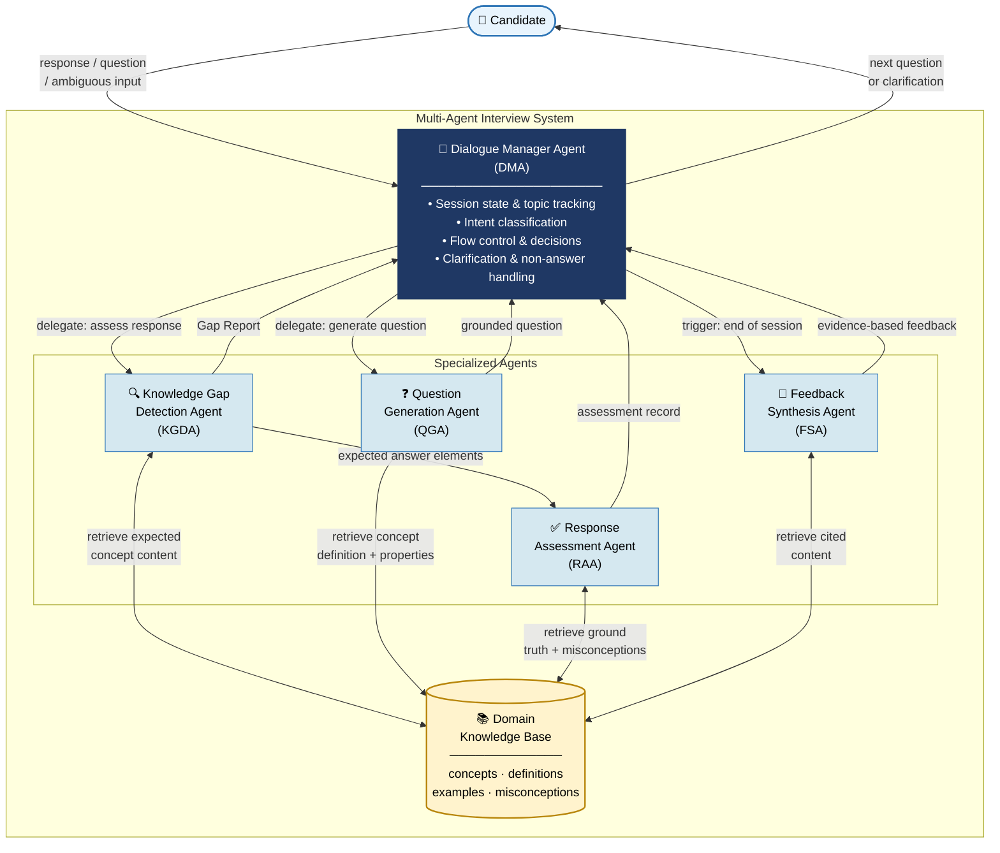

# Adaptive Technical Interviewing Using Agentic Retrieval-Augmented Generation: A Multi-Agent Architecture for Knowledge-Gap-Driven Assessment

## Abstract

Existing AI technical interview systems exhibit two compounding limitations: static question generation that ignores what a candidate demonstrably knows, and response assessment grounded solely in LLM parametric knowledge — a documented source of hallucination. This paper proposes an Agentic RAG-based approach for adaptive technical interviewing that addresses these limitations through four domain-specific mechanisms: knowledge-gap-driven retrieval, interview agentic decision policy, response grounding, and evidence-based feedback generation. A survey of 44 AI interview systems confirms no prior work applies Agentic RAG to in-session adaptive assessment. Evaluation uses LLM-simulated candidates at two proficiency levels and RAGAS-based metrics against a non-RAG multi-agent baseline.

**Keywords:** Agentic RAG, multi-agent systems, adaptive technical interviewing, knowledge gap detection, automated assessment, retrieval-augmented generation, LLM evaluation grounding

## 1. Introduction

**Problem:**

- AI interview systems depend on LLM parametric knowledge for both question generation and assessment → hallucination risk
- No existing system adapts interview trajectory based on what candidate demonstrates during the session
- Pathak & Pandey (2025): hallucinations in evaluation confirmed in live deployment (500+ candidates)
- Sanjana et al. (2025): survey of 44 systems — none ground assessment in retrieved domain content

**Gap:**

- Agentic RAG proven effective for grounding multi-turn dialogue in QA, tutoring, document analysis
- No prior work applies Agentic RAG to in-session adaptive technical interviewing

**Proposed approach:**

- Multi-agent Agentic RAG system: DMA + KGDA + QGA + RAA + FSA
- Four mechanisms: knowledge-gap-driven retrieval, agentic decision policy, response grounding, evidence-based feedback

**Research Questions:**

- RQ1: Can the system detect knowledge gaps and generate adaptive follow-up questions grounded in retrieved domain knowledge?
- RQ2: Does RAG-grounded assessment produce more accurate correctness judgments than LLM-only evaluation?
- RQ3: Does the system produce feedback of higher specificity and factual precision than an LLM-only baseline?

**Contributions:**

- Novel multi-agent Agentic RAG architecture for adaptive technical interviewing
- Four domain-specific agent designs (KGDA, QGA, RAA, FSA) with hybrid DMA orchestrator
- Synthetic evaluation protocol for interview systems without live participants
- Empirical comparison vs. non-RAG multi-agent baseline

## 2. Related Work and Research Gap

**AI recruitment tools (pre-interview):**

- ATS (Greenhouse, Workable): keyword-based resume filtering, no dialogue
- HireVue, X0PA AI, Pymetrics: predictive models on structured data, no adaptive assessment
- Lo et al. (2025): multi-agent RAG for resume screening — pre-interview only, not in-session

**Multi-agent interview systems:**

- Pathak & Pandey (2025): 4-agent system (Sourcing, Vetting, Evaluation, Decision)
  - Pinecone used for candidate response caching + fraud detection — not domain knowledge retrieval
  - Questions generated from job description templates — no gap-driven adaptation
  - Assessment via GPT-4 parametric knowledge only → hallucinations confirmed in deployment
  - Asynchronous batch interviews — structurally precludes real-time adaptive follow-up

**Agentic RAG landscape:**

- Singh et al. (2025): comprehensive survey — no interviewing application found
- Educational RAG (KA-RAG, tutoring systems): instructional context, not evaluative
- Key structural difference: tutoring = teach what learner lacks; interviewing = assess what candidate knows

**Gap summary:**

| System                 | RAG               | Adaptive Questioning | Grounded Assessment | Real-Time |
| ---------------------- | ----------------- | -------------------- | ------------------- | --------- |
| Lo et al. (2025)       | ✓ (resume)        | ✗                    | ✗                   | ✗         |
| Pathak & Pandey (2025) | Partial (cache)   | ✗                    | ✗                   | ✗         |
| Tutoring RAG           | ✓ (instructional) | Partial              | ✗                   | ✓         |
| **Proposed**           | **✓ (domain KB)** | **✓**                | **✓**               | **✓**     |

---

## 3. Proposed Methodology

### 3.1 System Architecture Overview

**Pipeline per candidate turn:**

1. Candidate submits input (response / clarification question / non-answer)
2. DMA classifies intent → decides action
3. If substantive response → delegate to KGDA for gap analysis
4. KGDA returns Gap Report → DMA updates session state, decides follow-up / move-on / close
5. If follow-up → delegate to QGA for grounded question generation
6. RAA scores response against retrieved ground truth → returns assessment record to DMA
7. Session end → DMA triggers FSA for feedback generation

_Figure 1: Multi-agent system architecture. DMA is the sole interface with the candidate. KGDA, QGA, RAA, FSA operate as internal tools. All retrieval is triggered by response analysis._

### 3.2 Domain Knowledge Base

**Schema per entry:**

- `concept_id`, `concept_name`, `definition`
- `key_properties`: list of properties a correct answer must address
- `common_misconceptions`: documented error patterns
- `example_correct_response`: reference answer at expected competency level
- `difficulty_level`: beginner / intermediate / advanced
- `related_concepts`: linked concept IDs

**Retrieval:** Dense vector search (cosine similarity) over concept embeddings — query vectors constructed from response analysis, not candidate query

### 3.3 Task-to-Agent Assignment

| Task                                                                     | Agent               | LLM? | Retrieval? |
| ------------------------------------------------------------------------ | ------------------- | ---- | ---------- |
| Session init, topic selection, state update                              | DMA (deterministic) | ✗    | ✗          |
| Intent classification, clarification, non-answer handling, flow decision | DMA (LLM)           | ✓    | ✗          |
| Retrieve expected concepts, analyze gaps                                 | KGDA                | ✓    | ✓          |
| Retrieve concept content, generate questions                             | QGA                 | ✓    | ✓          |
| Retrieve ground truth, score response                                    | RAA                 | ✓    | ✓          |
| Retrieve cited content, generate feedback                                | FSA                 | ✓    | ✓          |

### 3.4 Agent Descriptions

**DMA — Dialogue Manager Agent**

- Hybrid: deterministic state management + LLM conversational reasoning
- Maintains: topic coverage map, depth counters per topic, full Q&A history
- Decision space: delegate to KGDA / delegate to QGA / respond directly / move on / trigger FSA
- Sole interface with candidate — all other agents invisible

**KGDA — Knowledge Gap Detection Agent**

- Input: candidate response + expected concept list
- Retrieves: `key_properties` + `example_correct_response` for current topic concepts
- Output: Gap Report `{addressed_correctly, incomplete, incorrect, not_addressed, priority_gap}`
- Trigger: response quality (not candidate query) — detects omissions candidate would not flag

**QGA — Question Generation Agent**

- Input: Gap Report + Q&A history (or topic for opening question)
- Retrieves: `definition`, `key_properties`, `common_misconceptions` for target concept
- Output: grounded question + expected answer elements (forwarded to RAA)
- Constraint: must not repeat already-addressed content

**RAA — Response Assessment Agent**

- Input: candidate response + expected answer elements from QGA + retrieved ground truth
- Retrieves: `example_correct_response` + `common_misconceptions`
- Output: element-level scores + `grounding_source` field for full auditability
- Key property: correctness judged against retrieved reference, not LLM memory

**FSA — Feedback Synthesis Agent**

- Input: all RAA assessment records + DMA topic coverage map
- Retrieves: cited KB content for each identified gap
- Output: structured feedback report with per-topic summary + KB references
- Triggered once at session end

### 3.5 Technology Stack

| Component            | Technology                                      |
| -------------------- | ----------------------------------------------- |
| LLM backbone         | GPT-4o                                          |
| Vector store         | ChromaDB                                        |
| Embedding            | text-embedding-3-small                          |
| Orchestration        | LangGraph                                       |
| Evaluation           | RAGAS                                           |
| Candidate simulation | Custom LLM-persona pipeline (Claude 3.5 Sonnet) |

## 4. Evaluation Design

### 4.1 Synthetic Candidate Simulation

**Approach:** LLM personas encoding explicit proficiency profiles constructed from KB content

**Two proficiency levels:**

- **L1 — Beginner:** partial mastery of foundational concepts only
- **L3 — Advanced:** full mastery of foundational + intermediate, deliberate gaps in 3 advanced concepts

**Circularity mitigation:**

- Claude 3.5 Sonnet for simulation, GPT-4o for agents (model family separation)
- Personas constructed strictly from KB entries, not free LLM generation
- Sample validated against human expert judgment before full evaluation run

### 4.2 Metrics

**RQ1 — Adaptive Questioning:**

- Gap Coverage Rate: proportion of planted gaps detected and probed (target ≥ 0.80)
- Question Relevance: RAGAS context relevance of generated questions
- Redundancy Rate: proportion of questions overlapping already-addressed content (target ≤ 0.10)

**RQ2 — Assessment Accuracy:**

- Element-level Precision/Recall vs. ground truth persona profile
- Hallucination Rate: proportion of assessments citing incorrect/fabricated content
- Grounding Faithfulness: RAGAS faithfulness of assessment justifications

**RQ3 — Feedback Quality:**

- Evidence Citation Rate: proportion of feedback statements citing a specific KB entry
- Factual Accuracy: agreement of feedback with planted proficiency profile
- RAGAS Answer Relevance: feedback relevance to actual performance

### 4.3 Baselines and Ablations

**Main baseline:** Non-RAG multi-agent system — same architecture, template-based questions, LLM-only assessment (matches Pathak & Pandey, 2025 design)

**Ablations:**

- **No-KGDA:** random concept selection instead of gap-driven retrieval → isolates RQ1
- **No-RAA grounding:** LLM-only scoring instead of retrieved ground truth → isolates RQ2

## 5. Implementation Plan

### 5.1 12-Week Timeline

| Week  | Deliverable                                                              |
| ----- | ------------------------------------------------------------------------ |
| 1–2   | KB: 30–40 DSA concepts in schema, ChromaDB index, retrieval spot-checked |
| 3–4   | DMA + KGDA implemented and unit-tested                                   |
| 5–6   | QGA + RAA + FSA implemented; draft Section 3 in parallel                 |
| 7     | Full pipeline integrated; non-RAG baseline built                         |
| 8–9   | L1/L3 persona sessions run; raw results collected                        |
| 10    | Ablations run; results analyzed; failure modes documented                |
| 11–12 | Manuscript completed; supervisor review; submit                          |

**Writing strategy:** Sections 1–2 drafted weeks 1–2. Section 3 drafted weeks 5–6. Sections 4–5 filled in weeks 10–11. No first-draft writing in final two weeks.

### 5.2 Risks

| Risk                         | Mitigation                                                           |
| ---------------------------- | -------------------------------------------------------------------- |
| Simulation circularity       | Different model families; KB-grounded personas; human spot-check     |
| KB quality bottleneck        | Manual review weeks 1–2; iterative refinement                        |
| Integration delays week 7    | Clean agent interfaces from week 3; 1-week buffer before experiments |
| Supervisor review turnaround | Share draft sections incrementally from week 8                       |

## 6. Expected Contributions

**Theoretical:**

- Formalizes Agentic RAG adaptation to asymmetric evaluative dialogue
- Four structural properties distinguishing interview RAG from standard RAG:
  - Retrieval trigger = response quality, not user query
  - Decision policy requires LLM conversational reasoning, not deterministic rules
  - Interaction is asymmetric (assess, not teach)
  - Feedback must be auditable via traceable retrieval sources

**Practical:**

- Directly addresses hallucination problem in automated assessment (Pathak & Pandey, 2025)
- Domain-agnostic: deployable across technical disciplines without retraining
- Synthetic evaluation protocol reusable by broader community

## 7. Limitations

- Simulation validity: LLM personas may not capture full variance of real candidates
- KB dependency: system performance bounded by KB quality
- Single LLM backbone (GPT-4o): multi-model generalizability left as future work
- Single pilot domain (DSA): cross-domain generalizability left as future work

## References

1. Pathak, G., & Pandey, D. (2025). AI Agents in Recruitment. _SSRN_. https://ssrn.com/abstract=5242372
2. Lo, H., et al. (2025). Multi-Agent RAG for Resume Screening. _arXiv:2504.02870_
3. Sanjana, T., et al. (2025). AI-Assisted Interview Systems: A Survey. _ISCAP_. https://iscap.us/proceedings/2025/pdf/6438.pdf
4. Singh, A., et al. (2025). Agentic RAG: A Comprehensive Survey. _arXiv:2501.09136_
5. Reasoning Agentic RAG Survey. (2025). _arXiv:2506.10408_
6. KA-RAG. (2025). _Applied Sciences_
7. Es, S., et al. (2023). RAGAS. _arXiv:2309.15217_
